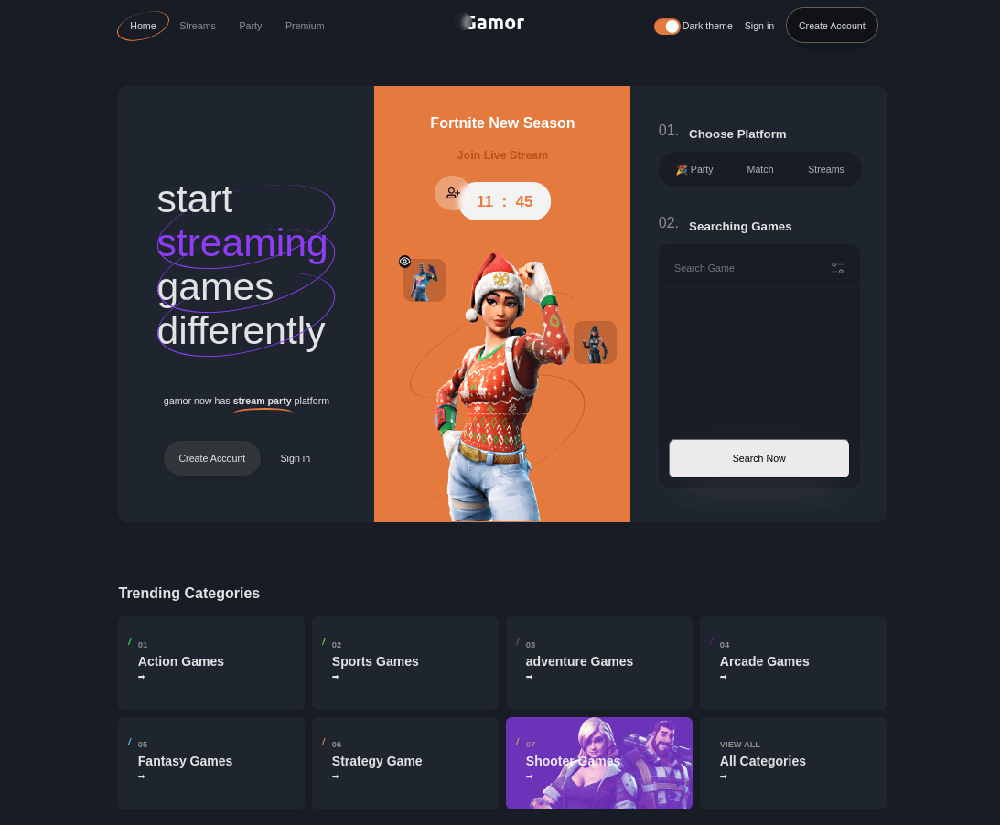

# React + Vite: Gamor Site

Este es un proyecto que implementé para dar solución a un ejercicio de prueba técnica de desarrollador web front-end. Para el login y el filtro se utilizaron datos generados, los cuales se encuentran en [esta](./src/mock/) ruta del proyecto.

## Vista previa

## Objetivos a evaluar

- [x] Maquetación y diseño responsive
- [x] Cambio de tema de color
- [x] Login y autenticación
- [x] Filtro de búsqueda

### Ejecución

Abrir una consola dentro del proyecto y ejecutar los comandos `yarn | npm install` y `yarn dev | npm run dev`, en ese orden. El proyecto se lanzará en la url <http://localhost:5173/>.

### Despliegue

Para visitar el sitio pulse el siguiente [enlace](https://hesoler-assessment-avg.netlify.app).
